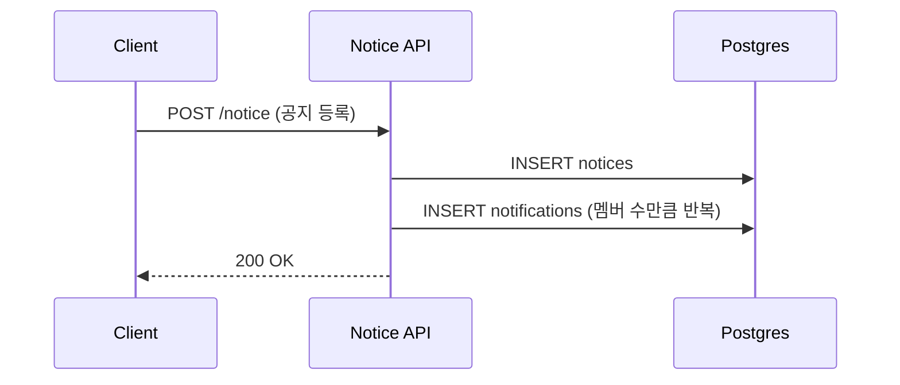
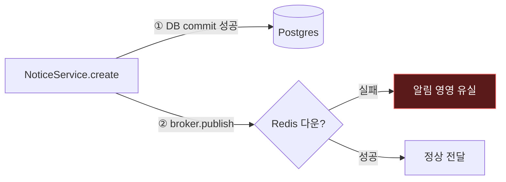
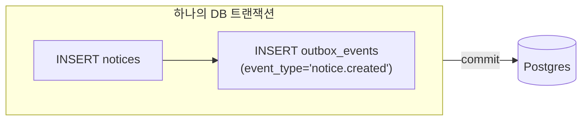
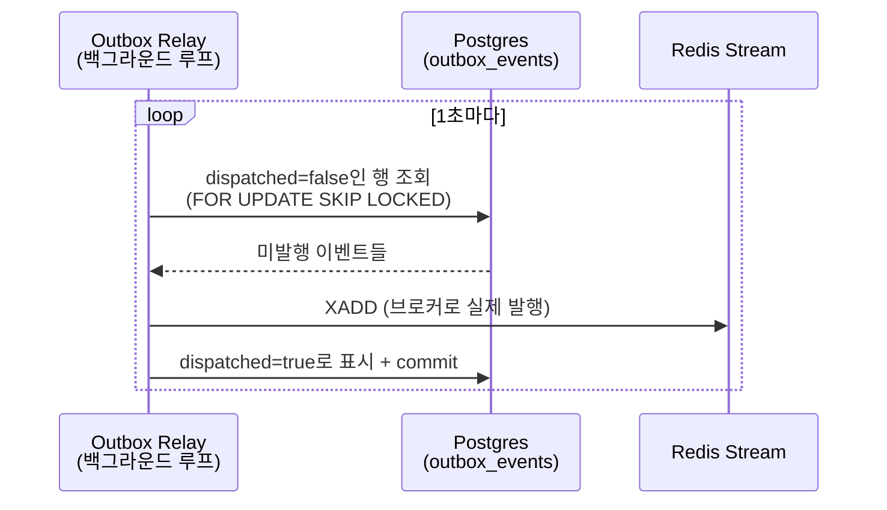
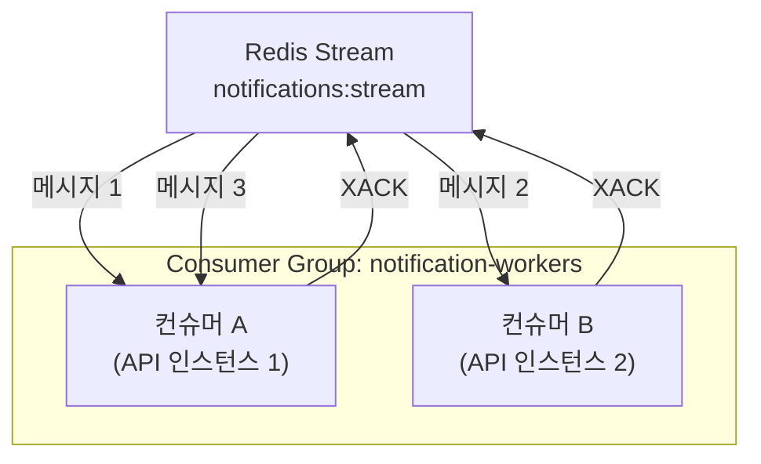
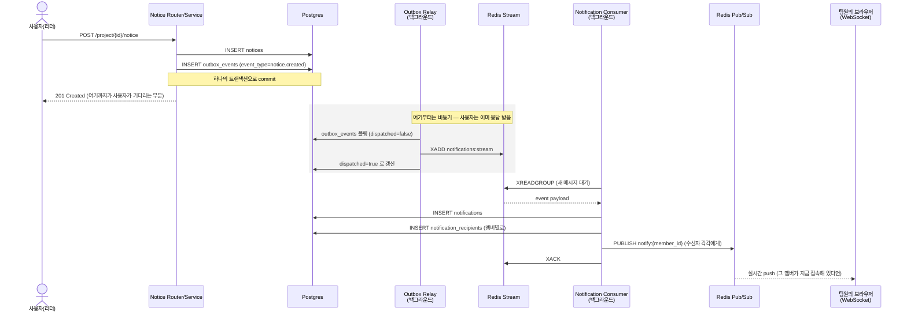

# 이벤트 기반 알림 파이프라인 이해하기

> 이 문서의 목적: `notification` 모듈에 새로 구현된 코드가 **왜 이렇게 생겼는지**를 기초 개념부터 설명한다. 코드를 다시 읽지 않아도 이 문서만 보고 "아 이래서 이렇게 짰구나"가 되는 걸 목표로 함.

---

## 0. 한 문장 요약

> **공지를 등록하면, 그 사실이 큐에 실려서 흘러가다가, 최종적으로 각 팀원에게 알림이 DB에 쌓이고 실시간으로도 전달된다. 이 "흘러가는 과정"을 안전하게 만들기 위해 Outbox 패턴 + Redis Streams + Consumer Group + Pub/Sub 이라는 4가지 개념을 조합했다.**

이 4개 중 하나라도 몰라도 전체 그림이 이해 안 되니, 순서대로 하나씩 쌓아가면서 설명한다.

---

## 1. 출발점 — 제일 단순한(그러나 문제 있는) 방식

만약 그냥 "공지 등록되면 바로 알림 테이블에 넣자"라고 짰다면 이렇게 됐을 것이다.



**당장은 문제없어 보인다.** 그런데 두 가지가 걸린다.

1. **책임이 섞인다.** "공지를 저장하는 로직"과 "누구에게 어떻게 알릴지"가 같은 함수 안에 뒤엉킨다. 나중에 "카톡 알림도 보내자", "푸시 알림도 보내자"가 추가되면 `NoticeService.create()` 안에 계속 코드가 늘어난다.
2. **부분 실패가 애매하다.** 멤버가 50명인 프로젝트에서 30번째 멤버 알림 INSERT 중 에러가 나면? 공지는 이미 저장됐는데 알림은 반만 만들어진 상태가 된다.

지금 당장은 이 정도로도 충분할 수 있다. 하지만 우리가 실제로 하고 싶었던 건 **"메시지 브로커(큐)를 하나 도입해서, 알림 로직을 공지/프로젝트 로직으로부터 분리하고, 이벤트 기반 아키텍처를 경험해보는 것"** 이었다. 그러려면 "저장"과 "전달"을 분리해야 하는데, 그 순간 아래에서 설명할 **Dual Write 문제**가 등장한다.

---

## 2. 핵심 문제 — Dual Write Problem (이중 쓰기 문제)

"저장"과 "전달"을 분리한다는 건, 서로 다른 두 시스템에 각각 쓴다는 뜻이다.

- 시스템 A: **Postgres** (공지 데이터를 저장)
- 시스템 B: **메시지 브로커** (예: Redis, Kafka — "공지가 등록됐다"는 사실을 알림 처리기에게 전달)

이 둘은 **서로 다른 트랜잭션**이다. 즉 아래와 같은 코드를 짜면:

```python
await db.save(notice)        # ① Postgres에 저장
await db.commit()
await broker.publish(event)  # ② 브로커에 발행
```

①은 성공했는데 ②가 실패하면(네트워크 끊김, 브로커 다운 등) **공지는 저장됐지만 아무도 알림을 못 받는** 상황이 생긴다. 반대로 순서를 바꿔서 ②를 먼저 해도, ②는 성공했는데 ①(commit)이 실패하면 **존재하지도 않는 공지에 대한 알림**이 나가버린다.



이걸 **Dual Write Problem**이라고 부른다. "두 시스템에 나눠 쓰는데, 그 둘을 동시에 성공/실패시킬 방법이 없다"는 문제. 우리가 구현한 코드에서 이 문제를 피하기 위해 쓴 게 **Outbox 패턴**이다.

---

## 3. 해결책 ① — Transactional Outbox 패턴

아이디어는 단순하다.

> **"브로커에 진짜로 보내는 건 나중에 하고, 일단 같은 트랜잭션 안에서 '보낼 것'이라는 사실만 Postgres에 같이 저장해두자."**

즉, 브로커에 직접 쓰는 대신 **`outbox_events`라는 평범한 테이블에 INSERT** 한다. 이건 공지를 저장하는 것과 **완전히 같은 DB, 같은 트랜잭션**이므로 원자성이 보장된다 — 둘 다 성공하거나, 둘 다 롤백되거나 둘 중 하나다.



실제 코드 (`app/modules/notice/service.py`):

```python
saved = await self.repository.save(notice)          # 공지 저장

recipient_ids = await self._get_project_member_ids(data.project_id)
NotificationEvents.notice_created(                    # outbox_events에 INSERT (커밋 안 함)
    self.session,
    notice_id=saved.id,
    title=saved.title,
    detail=saved.detail,
    recipient_ids=recipient_ids,
)

await self.session.commit()   # <- 공지 저장 + outbox 기록이 여기서 같이 커밋된다
```

이제 "브로커로 진짜 발행하는 일"은 누가 하나? **별도의 백그라운드 프로세스(릴레이)** 가 `outbox_events` 테이블을 주기적으로 들여다보면서 처리한다. 이게 `outbox_relay.py`다.



**왜 이렇게 하면 안전한가?**
- 브로커(Redis)가 잠깐 죽어 있어도, 이벤트는 Postgres에 그대로 남아있다 (`dispatched=false`인 채로).
- 릴레이는 다음 폴링에서 다시 시도한다. → **최소 한 번은 전달됨(at-least-once)** 이 보장된다.
- `FOR UPDATE SKIP LOCKED`는 "이 행 지금 다른 트랜잭션이 잡고 있으면 건너뛰어라"는 뜻이다. 릴레이 프로세스가 여러 대 떠 있어도 같은 이벤트를 두 번 집어가지 않는다.

> 💡 **비유**: 우체국에 편지를 부치기 전에, 일단 "이 편지를 부칠 예정이다"라고 내 다이어리(Outbox)에 적어둔다. 다이어리에 적는 것과 편지 쓰는 것은 같은 자리에서 한 번에 하니까 절대 어긋나지 않는다. 그리고 우체부(릴레이)가 주기적으로 다이어리를 확인하며 실제로 편지를 부치고, 부친 건 다이어리에 체크 표시를 한다.

---

## 4. 해결책 ② — 메시지 브로커로 Redis Streams를 쓴 이유

여기서 "브로커"라고 부른 게 정확히 뭔지 짚고 넘어가야 한다. 이 프로젝트는 이미 **채팅 기능에서 Redis Pub/Sub**을 쓰고 있었다. 그런데 알림 파이프라인에는 Pub/Sub이 아니라 **Redis Streams**라는 걸 새로 썼다. 왜 같은 Redis인데 다른 기능을 썼을까?

### Redis Pub/Sub (기존 채팅에서 사용 중)
- 메시지를 **구독 중인 사람에게만** 즉시 전달.
- **구독자가 그 순간 없으면 메시지는 그냥 사라진다.** (신문 방송처럼 — 그 시간에 안 보고 있었으면 못 봄)
- 채팅에는 이게 맞다: 메시지 자체는 이미 DB(`chat_messages`)에 저장돼 있고, Pub/Sub은 오직 "지금 접속해 있는 다른 서버 인스턴스의 브라우저 세션에 실시간으로 전달"하는 역할만 한다.

### Redis Streams (이번에 알림 파이프라인에 새로 사용)
- 메시지가 **로그처럼 순서대로 쌓인다.** 안 읽어가도 사라지지 않는다.
- **Consumer Group**이라는 개념으로 "여러 소비자가 나눠서 읽되, 같은 메시지를 두 소비자가 동시에 처리하지 않도록" 만들 수 있다.
- 처리 완료를 명시적으로 확인(`XACK`)해야 하고, 안 하면 그 메시지는 "처리 안 됨" 상태로 남아 재시도 대상이 된다.

**알림에 Streams를 쓴 이유**: 알림은 채팅과 달리 "그 순간 안 보고 있어도 반드시 나중에라도 처리되어 DB에 남아야" 한다 (안 읽은 알림 목록 기능이 있으니까). Pub/Sub처럼 "그 순간 안 받으면 유실"되면 안 되고, "확실히 한 번은 처리된다"는 보장이 필요해서 Streams를 골랐다.

| | Redis Pub/Sub | Redis Streams |
|---|---|---|
| 안 읽으면? | 유실 | 남아있음 |
| 처리 보장 | 없음 (broadcast) | Consumer Group + ACK로 보장 |
| 이 프로젝트에서 쓰는 곳 | 채팅 실시간 전달, 알림 실시간 전달 | 알림 이벤트를 안전하게 넘기는 큐 |
| 비유 | 실시간 라디오 방송 | 카톡 안읽은 메시지 목록 |

즉 **우리 파이프라인은 이 둘을 역할을 나눠서 같이 쓴다**: "확실한 처리"가 필요한 구간(Outbox → 알림 생성)은 Streams, "지금 보고 있으면 바로 보여주기"가 필요한 구간(알림 생성 → 웹소켓)은 Pub/Sub. 이건 6번 섹션 전체 그림에서 다시 보인다.

---

## 5. 해결책 ③ — Consumer Group (경쟁 소비자 패턴)

서버가 한 대만 떠 있으면 사실 이 개념은 몰라도 된다. 하지만 이 서버를 나중에 2대, 3대로 늘린다고 하면 (`docker-compose`에서 `api` 서비스를 스케일 아웃) 문제가 생긴다: **알림 컨슈머도 인스턴스 개수만큼 늘어나는데, 같은 이벤트를 여러 인스턴스가 동시에 집어가서 알림을 중복 생성하면 안 된다.**

Redis Streams의 **Consumer Group**이 이걸 해결해준다: 그룹에 속한 컨슈머들은 "같은 스트림을 나눠서" 읽는다. 메시지 하나는 그룹 내 정확히 한 컨슈머에게만 배달된다.



우리 코드(`consumer.py`)에서:
- `XGROUP CREATE`로 그룹을 만들고 (이미 있으면 무시)
- `XREADGROUP`으로 "아직 아무도 안 가져간 메시지(`>`)"를 읽고
- 처리에 성공하면 `XACK`으로 "나 이거 다 처리했음"이라고 확인
- 처리 중 예외가 나면 **XACK을 안 한다** → 그 메시지는 "pending" 상태로 남아서, 나중에 재처리 대상이 될 수 있다 (지금 코드는 재처리 로직 자체는 아직 안 짜여 있고, 실패 로그만 남기고 넘어감 — 10번 섹션의 확장 포인트 참고)

> 💡 **비유**: 콜센터에 상담원이 여러 명 있고, 대기 콜이 큐에 쌓인다. 상담원 한 명이 콜을 받으면 그 콜은 다른 상담원한테는 안 간다. 상담이 끝나야(ACK) "처리 완료" 처리된다. 상담 중에 전화가 끊기면(예외 발생, ACK 안 함) 그 콜은 다시 대기열에 남는다.

---

## 6. 전체 흐름 — 공지 등록부터 웹소켓 알림까지

지금까지 나온 개념(Outbox → Stream → Consumer Group → Pub/Sub)을 실제 코드 흐름에 다 이어 붙이면 이렇게 된다.



핵심은 **위쪽 절반(사용자가 기다리는 부분)이 짧다**는 것. 사용자는 "공지 저장 + outbox 기록"만 기다리면 되고, 나머지(브로커 발행, 알림 생성, 실시간 push)는 전부 백그라운드에서 비동기로 처리된다. 알림 대상이 몇 명이든, 알림 발송 로직에 버그가 있든 없든 **공지 등록 API 응답 속도에는 영향이 없다.**

---

## 7. "그래서 이 개념이 어느 파일에 있는데?" — 코드 위치 매핑

| 개념 | 파일 | 역할 |
|---|---|---|
| Outbox 테이블 | `app/modules/notification/models.py` → `OutboxEvent` | "발행 예정" 이벤트를 담는 평범한 Postgres 테이블 |
| 이벤트 발행 진입점 | `app/modules/notification/events.py` → `NotificationEvents` | 다른 모듈(notice, project)이 "이런 일이 있었다"고 알리는 창구. 여기 메서드 하나 추가하면 새 이벤트 타입 추가 끝 |
| Outbox → Stream 릴레이 | `app/modules/notification/outbox_relay.py` | Postgres를 폴링해서 Redis Stream으로 실제 발행 |
| Stream → Notification 컨슈머 | `app/modules/notification/consumer.py` | Consumer Group으로 스트림을 읽어 `Notification`/`NotificationRecipient` 생성 |
| 실시간 push | `app/modules/notification/realtime.py` → `NotificationConnectionManager` | Redis Pub/Sub 구독 + 로컬 WebSocket 연결 관리 (채팅의 `ConnectionManager`와 동일 패턴) |
| REST API | `app/modules/notification/router.py` | 알림 목록/읽음 처리/웹소켓 엔드포인트 |
| 백그라운드 실행 | `app/main.py` → `lifespan()` | 앱 시작 시 릴레이·컨슈머를 asyncio task로 상시 구동 |
| 실제 이벤트 발생 지점 | `app/modules/notice/service.py` (공지 등록 → 전체 팬아웃)<br/>`app/modules/project/service.py` (초대 → 1명) | `NotificationEvents`를 호출하는 실제 도메인 코드 |
| DB 스키마 변경 | `alembic/versions/6813df31bc67_add_notification_pipeline.py` | `outbox_events`, `notification_recipients` 테이블 및 `notifications.event_type` 컬럼 추가 |

---

## 8. 자주 헷갈리는 것들 정리

**Q. Notification과 NotificationRecipient는 왜 나뉘어 있어?**
공지 하나가 팀원 10명에게 팬아웃되면, "알림 내용(제목/본문)"은 1개인데 "읽음 여부"는 10명이 각자 다르다. 그래서 `Notification`(내용, 1건)과 `NotificationRecipient`(수신자별 읽음 상태, N건)을 분리했다. 마치 이메일 한 통을 여러 명에게 보내면, 메일 본문은 하나지만 "누가 읽었나"는 수신자별로 다른 것과 같다.

**Q. Outbox 테이블 폴링이면 결국 Kafka Connect의 CDC(Change Data Capture)랑 뭐가 다른가?**
개념은 같다. 우리는 애플리케이션 코드가 직접 폴링(`SELECT ... FOR UPDATE SKIP LOCKED`)하는 **폴링 방식 Outbox**를 썼다. 실무에서 규모가 커지면 Postgres의 WAL(Write-Ahead Log)을 Debezium 같은 도구가 실시간으로 읽어서 Kafka로 흘려보내는 **CDC 방식**을 쓰기도 한다. 폴링 방식은 구현이 간단하지만 약간의 지연(최대 1초, `POLL_INTERVAL_SECONDS`)이 있고, CDC는 지연이 거의 없지만 인프라가 더 필요하다.

**Q. 왜 Kafka 안 쓰고 Redis Streams를 썼어?**
지금 이 프로젝트 규모(팀플 매칭 서비스, 트래픽 낮음)에서 Kafka 클러스터를 새로 운영하는 비용 대비 얻는 게 적다. 이미 Redis가 인프라에 있으니(채팅에서 사용 중) Streams로 "메시지 큐 + Consumer Group"이라는 핵심 개념을 그대로 경험할 수 있다. 트래픽/파티셔닝/보관 기간 요구가 커지면 그때 Kafka로 교체하면 되는데, 그 교체 지점이 `outbox_relay.py`(발행 부분)와 `consumer.py`(구독 부분) 딱 두 파일로 격리돼 있어서 도메인 코드(notice, project)는 전혀 안 건드려도 된다.

**Q. at-least-once가 뭐고 왜 "정확히 한 번(exactly-once)"이 아니야?**
"최소 한 번은 전달됨"을 보장하는 게 at-least-once다. 우리 파이프라인은 실패 시 재시도를 하기 때문에 **아주 드물게 같은 알림이 두 번 생성될 가능성**이 이론상 있다(예: 컨슈머가 DB에 알림을 저장한 직후, XACK을 보내기 직전에 죽으면 → 재시작 후 같은 메시지를 다시 처리). 완벽한 exactly-once는 분산 시스템에서 구현 비용이 매우 크기 때문에, 대부분의 실무 시스템(우리 것 포함)은 at-least-once + 멱등성(idempotency, "같은 이벤트가 두 번 와도 결과가 같도록 만드는 것")으로 타협한다. 지금 코드에는 멱등성 처리가 없어서, 극히 드문 중복 알림 가능성은 열려 있다 — 10번 섹션에서 개선 방향으로 남겨둠.

---

## 9. 용어 사전

| 용어 | 한 줄 설명 |
|---|---|
| **메시지 브로커** | 서비스 A가 서비스 B에게 "이런 일이 있었다"를 직접 호출 없이 전달해주는 중간 시스템 (Redis, Kafka, RabbitMQ 등) |
| **Dual Write Problem** | 서로 다른 두 시스템(DB, 브로커)에 각각 쓰기 때문에, 하나만 성공하고 하나는 실패하는 상황을 막을 수 없는 문제 |
| **Transactional Outbox** | 브로커에 직접 안 쓰고, 같은 DB 트랜잭션 안에 "보낼 것"을 기록해두는 패턴. 별도 프로세스가 나중에 실제 발행 |
| **Pub/Sub** | 발행-구독. 그 순간 구독 중인 대상에게만 즉시 전달, 안 보고 있으면 유실 |
| **Stream (Redis Streams)** | 로그처럼 순서대로 쌓이는 메시지 저장소. 안 읽어가도 사라지지 않음 |
| **Consumer Group** | 여러 소비자가 하나의 스트림을 "나눠서" 읽게 하는 그룹. 메시지 하나는 그룹 내 한 소비자에게만 배달 |
| **XADD / XREADGROUP / XACK** | Redis Streams 명령어. 각각 "메시지 추가", "그룹으로 읽기", "처리 완료 확인" |
| **팬아웃 (Fan-out)** | 이벤트 하나를 여러 수신자에게 뿌리는 것 (공지 1건 → 팀원 10명에게 알림 10건) |
| **at-least-once** | "최소 한 번은 전달됨"을 보장하는 수준. 중복 가능성은 있음 |
| **멱등성 (Idempotency)** | 같은 요청/이벤트가 여러 번 처리돼도 결과가 달라지지 않는 성질 |
| **FOR UPDATE SKIP LOCKED** | Postgres 문법. "이미 다른 트랜잭션이 잠근 행은 건너뛰고 조회" — 여러 워커가 같은 큐를 동시에 폴링해도 안전하게 나눠 가지도록 함 |

---

## 10. 지금 안 한 것 (일부러 남겨둔 확장 포인트)

- **재시도 상한 / Dead Letter Queue**: 지금은 `OutboxEvent.attempts`가 실패 횟수를 세기만 하고, N번 넘으면 포기하고 별도 테이블로 격리하는 로직은 없음. 계속 실패하면 영원히 재시도만 함.
- **멱등성 키**: 컨슈머가 같은 이벤트를 두 번 처리해도 알림이 중복 생성되지 않도록 막는 장치가 없음 (드문 케이스지만).
- **다른 이벤트 확장**: `work.created`(작업 생성 시 담당자 알림) 같은 것도 같은 패턴으로 `NotificationEvents`에 메서드만 추가하면 됨. 지금은 `notice.created`, `project.invited` 두 개만 연결돼 있음.
- **Kafka로 교체**: 트래픽이 커지면 `outbox_relay.py`의 `redis_client.xadd(...)` 한 줄과 `consumer.py`의 구독 부분만 Kafka producer/consumer로 바꾸면 된다. 도메인 서비스(notice, project) 코드는 손댈 필요 없음 — 이게 이 아키텍처를 이렇게 나눈 이유이기도 함.
